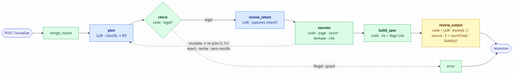
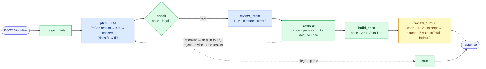

# ClinicalTrials.gov Query-to-Visualization Agent

A backend service that turns a natural-language clinical-trials question (plus optional structured
fields) into a **structured visualization specification** sourced from the
[ClinicalTrials.gov Data API v2](https://clinicaltrials.gov/data-api/api), with **deep citations**
tying every datum back to its `nct_id` and an exact field excerpt.

**▶ Live demo (no install):** **<https://nguiasoren.github.io/cheiron-clinicaltrials-agent/>** — the
citation viewer with all 15 example runs; each shows its natural-language query, its chart or network
graph, and every datum's citations clickable to the source trials on clinicaltrials.gov.

**▶ Ask it your own question:** run the service and open the viewer *from it* —
`uv run uvicorn app.main:app` then <http://localhost:8000/demo/viewer.html>. The ask bar posts to
`POST /visualize/stream`, so the pipeline's fixed 8-stage status enum lights up live
(`planning → validating → plan_approved → fetching → aggregating → building_spec → verifying → done`)
and the result renders through the same chart + citation code as the saved runs. Served from the app
it is same-origin, so no CORS is involved; see [Quickstart](#quickstart).

**Highlights:**

- **The model structurally cannot emit a wrong number.** The LLM only *plans*; deterministic code
  computes every value and reconciles it against the API's own `countTotal`. That is what makes the
  numbers trustworthy and the deep citations claimable — and it is enforced at the schema layer, not by
  hope (the planner's typed output has no numeric field a count could live in).
- **15 example runs, simple → highly complex, off one core** — every renderable chart type, a real
  drug↔drug network, two *"knows when not to chart"* refuses, a clarification, and three composed "boss"
  queries (four stacked filters → 3950 collapses to 229; a live-neutralized injection; a
  compare-of-filtered-arms where each arm carries its own four-filter stack).
- **A security vulnerability found and fixed against the *live* API** — a real Essie query-injection
  surface, probed, measured, and neutralized at near-zero recall cost.
- **Provider-agnosticism proven, not claimed** — the same query planned by GPT *and* by Claude yields
  identical numbers (the number is the tool's, not the model's).
- **Re-verify it yourself, offline, `$0`** — one command (`scripts/verify_examples.py`) re-checks every
  shipped number and every citation with the runtime's own verifier code.

> **The governing invariant:** *the LLM decides **what** to compute; deterministic tools compute
> it — the model never emits a number.*

Every value a user sees — a bar height, a time-bucket count, an edge weight — was computed by code
that pages the real API and reconciles its result against the API's own `countTotal`. The language
model chooses the *plan* (which query class, which field, which filters, which chart); it never
counts, pages, or aggregates. That single constraint is what makes the numbers trustworthy and the
citations claimable, and it is enforced structurally: the planner's typed output has no numeric
field in which a count could even be represented.

**Headline:** a deterministic visualization engine orchestrated by a ReAct planner routing to
validated recipes. The planner interprets the request and selects a query recipe; deterministic
tools perform retrieval, aggregation, and spec generation; a schema checker and two reviewers ensure
correctness before and after execution.

**Topology:** the pipeline is a LangGraph graph that is **cyclic, not a DAG** — a linear spine
(`merge_inputs → plan → check → review_intent → execute → build_spec → review_output → respond`) plus
a *bounded* escalation back-edge to `plan` (a checker-reject / intent-revise / zero-results re-plans
at most once), which is exactly why it uses LangGraph rather than a plain DAG runner.

```
Planner(LLM, ReAct) → Plan Checker(CODE) → Intent Reviewer(LLM) → Execute(CODE runner)
   → Viz-spec builder(CODE) → Output Reviewer(CODE substring/reconcile + LLM faithful?) → Response
   ── SSE status enum throughout · LangGraph graph · provider-agnostic adapter · stateless + cache ──
```

<p align="center"></p>

*Blue = LLM (decides **what** to compute) · green = deterministic **code** (computes it) · yellow = both. The dashed **escalation** edge is the bounded ≤1 re-plan — gate-triggered by a checker-reject, an intent-revise, or zero results, never planner-initiated; it is the one back-edge that makes this a **cyclic graph, not a DAG**, and the reason it uses LangGraph. (One rare path is omitted for clarity: an unresolvable NL referent short-circuits `plan → clarification`.) The image renders in any Markdown viewer; the Mermaid source that regenerates it (live on GitHub) is below.*

<details>
<summary>Pipeline diagram — Mermaid source</summary>



</details>

There is exactly **one Checker (code) and two Reviewers (LLM)**; the ReAct loop lives only in `plan`;
`execute` is deterministic. The two gate families never blur: a **Checker** is deterministic code
(mechanical legality — is every token, field, and range real?); a **Reviewer** applies LLM judgment
(semantic — did the planner understand the question? does the output faithfully answer it?). Neither
reviewer can introduce a number: both are gates that emit `approve`/`revise`/`flag` on already-typed
or already-computed data.

---

## Quickstart

```bash
# 1. install (either works)
uv sync                                   # or:  python -m venv .venv && pip install -e ".[dev]"

# 2. health/skeleton check (imports + graph compiles + goldens validate + one live reconciliation)
uv run ct-doctor

# 3. PROVE IT YOURSELF — re-check every shipped example, offline, $0, no key needed:
uv run python scripts/verify_examples.py  # -> 16/16 examples pass all 5 invariants
#   (reconciliation Σ==countTotal, element-precise citations, no LLM-authored number —
#    using the runtime's OWN verifier code, so it proves exactly what the live path proves)

# 4. boot the service
uv run uvicorn app.main:app --reload
curl localhost:8000/healthz               # -> {"status":"ok"}

# 5. ask it something — the viewer, served BY the app (same-origin, so no CORS):
open http://localhost:8000/demo/viewer.html
#   type a question -> POST /visualize/stream -> the 8 status stages light up as the
#   graph advances -> the result renders through the same chart + citation code as the
#   saved runs. Optional structured fields (drug_name, condition, trial_phase, ...) are
#   under "+ structured fields". Opening demo/viewer.html straight off disk also works —
#   a narrow CORS rule admits loopback and file:// (`null`) origins only.
```

> **Reviewer shortcut:** step 3 needs no network and no API key — it re-proves that every number in
> the shipped `examples/*.json` reconciles and every citation is a real source substring, in one
> command. `uv run pytest` runs the same gate plus the full suite (582 tests).

**Runs with no API key.** With no LLM provider configured the service still runs end-to-end on a
deterministic offline `StubAdapter` (a fixed plan, zero network), so it never hard-crashes and the
whole test suite runs without secrets. To exercise the real agentic layer, set a provider:

```bash
# OpenAI (the reference path)
export LLM_PROVIDER=openai OPENAI_API_KEY=sk-...
export LLM_MODEL_PLANNER=gpt-5.4 LLM_MODEL_REVIEWER=gpt-5.4-mini

# Anthropic (the second concrete adapter — proves the adapter is provider-agnostic)
export LLM_PROVIDER=anthropic ANTHROPIC_API_KEY=sk-ant-...
export LLM_MODEL_PLANNER=claude-sonnet-5 LLM_MODEL_REVIEWER=claude-haiku-4-5
```

The ClinicalTrials.gov API needs no key (it is a public registry). The **only** secret in the whole
system is the LLM provider key, read solely by `app/llm/adapter.py`, never passed to a tool, never
logged. Every guard, cap, and timeout is env-overridable — see `.env.example` and `app/config.py`.

Two endpoints: `POST /visualize` (sync, returns the full envelope) and `POST /visualize/stream` (SSE,
emits a fixed enum of status events `planning → … → done` and a terminal event carrying the full
spec, so the stream is frontend-consumable without exposing the model's private reasoning).

---

## Request schema

`POST /visualize` accepts JSON. Only `query` is required; the structured fields are authoritative for
the dimension they name (see **CC-1** under design decisions). Unknown fields are rejected (`422`,
fail-closed). Full model + validators: `app/api/schemas.py::VisualizeRequest`.

| Field | Type | Req | Notes |
|---|---|---|---|
| `query` | string | **yes** | The NL question. Non-empty after strip, ≤ 500 chars. |
| `drug_name` | string? | no | Authoritative drug dimension. ≤ 200 chars. |
| `condition` | string? | no | Authoritative condition dimension. ≤ 200 chars. |
| `sponsor` | string? | no | Authoritative sponsor dimension. ≤ 200 chars. |
| `country` | string? | no | Authoritative country dimension. ≤ 200 chars. |
| `trial_phase` | string? | no | A human phase string ("Phase 1", "1/2", "Early Phase 1", "NA"). A value that names **no** real phase is a malformed *structured* input → `422` with the valid list (distinct from a mistyped free-text entity, which stays a `200` empty result). |
| `study_type` | string? | no | Study-type hint, tokenized downstream. |
| `start_year`, `end_year` | int? | no | Inclusive year bounds (1900–2100). `start_year ≤ end_year` enforced. |
| `interventional_only` | bool | no | Offer the interventional denominator for a phase distribution (observational trials legitimately have no phase). Default `false`. |

```json
{ "query": "How are interventional pancreatic cancer trials distributed across phases?",
  "condition": "pancreatic cancer", "interventional_only": true }
```

## Response schema

Every endpoint returns one envelope (`app/api/schemas.py::VisualizeResponse`). Field presence is
keyed off two discriminators:

- `status`: `ok` · `empty` · `too_large` · `error`
- `kind`: `visualization` · `answer` · `clarification`

| Field | Meaning |
|---|---|
| `visualization` | The custom canonical spec `{type, title, encoding, data}`. `type` ∈ {`bar`, `grouped_bar`, `time_series`, `histogram`, `network_graph`, `single_value`, `table`}. `data` is a **row list** for standard charts and `{nodes, edges}` for a network (a validator enforces the type↔shape invariant). Null on `kind:"answer"`. |
| `vega_lite` | A ready-to-render Vega-Lite projection for standard charts (a convenience for a frontend). Null for network / answer / clarification / too_large. |
| `answer` | The natural-language answer for `kind:"answer"` (a scalar count, a yes/no, or the `too_large` refuse). Code-templated, never model-authored. |
| `question` | The disambiguating question for `kind:"clarification"`. Code-templated. |
| `error` | A top-level `{code, message}` for `status:"error"` — never a half-populated viz. |
| `citations` | A top-level `{nct_id: Citation}` dedup index (the load-bearing citations live inline on each datum). |
| `meta` | Provenance + interpretation: `count_basis` (the dual counts + the reconciliation total), `date_field_used`, `time_granularity`, `filters` (the effective filters applied), `query_provenance` (endpoint + wire params, for reproducibility), `retrieved_at`, `source`, `partial` (a genuine truncation; null for `too_large`), and `notes` (interpretation + honest data-quality disclosures). |

Each chart `Datum` carries `value`/`label`, its class channel (`period` for time series, `series` for
compare, `bin_start`/`bin_end` for histograms), the **dual counts** `count_trials` (distinct nctId —
the number that reconciles) and `count_mentions` (the honest per-membership tally), and its inline
`citations[]`. A network `Edge` carries a `weight` and **two** citations (one per endpoint).

```jsonc
// POST /visualize  →  (rung 02, abridged)
{ "status": "ok", "kind": "visualization",
  "visualization": { "type": "bar", "title": "Phase distribution of interventional pancreatic cancer trials",
    "encoding": { "x": {"field":"label"}, "y": {"field":"count_trials","unit":"trials"} },
    "data": [
      { "value": "PHASE1", "label": "Phase 1", "count_trials": 895,
        "contributing_count": 895, "citations_truncated": true,
        "citations": [ { "nct_id": "NCT00001431",
                         "excerpt": "A Phase I Trial of Gemcitabine and Radiation in …",  // §5: readable brief title
                         "field_path": "protocolSection.designModule.phases",
                         "value": ["PHASE1"], "matched_value": "PHASE1" }  /* …up to 20 */ ] },
      { "value": "PHASE1|PHASE2", "label": "Phase 1/2", "count_trials": 505, "…": "…" },
      { "value": "PHASE2", "label": "Phase 2", "count_trials": 1143, "…": "…" }
      /* Early Phase 1: 109 · Phase 1: 895 · Phase 2/3: 58 · Phase 3: 232 · Phase 4: 71 */
    ] },
  "meta": { "count_basis": { "trials": 3950, "mentions": 3950 }, "source": "clinicaltrials.gov", "…": "…" } }
```

---

## Example runs

**15 real natural-language queries, simple → highly complex, with their ACTUAL JSON**, live in
`examples/run_NN_*.json` and are narrated in **[`EXAMPLE_RUNS.md`](EXAMPLE_RUNS.md)**. Every one is a
real end-to-end output — an NL query in, JSON out — generated by `scripts/run_ladder.py` driving each
query through the **real LLM planner** (no query class is ever passed in; the model classifies). Full
untruncated JSON is regenerated by the script, never hand-edited.

The first cluster (02–07) covers **one of each renderable mark**; the middle (08–12) is the *judgment*
cases (knowing when *not* to answer); the boss tier (13–15) is composed / adversarial queries.

| # | Query (natural language) | → Chart | What it demonstrates |
|---|---|---|---|
| 01 | *Is there any recruiting trial for glioblastoma?* | *(prose answer)* | **No chart** — identifies that a viz isn't needed. `Yes — 325`. |
| 02 | *How are interventional pancreatic cancer trials distributed across phases?* | **bar** | The killer gate: **Σ distinct-nctId == countTotal == 3950**; explicit 63%-class `NA`; composite `Phase 1/2`. |
| 03 | *How has the number of melanoma trials changed per year since 2015?* | **time_series** | Fill-0 gap years; a future `startDate` flagged **`planned`** (not clamped); partial-current-year disclosure. |
| 04 | *Show the distribution of study durations for interventional pancreatic cancer trials* | **histogram** | A continuous magnitude (`completionDate − startDate`) binned into ranges — not a categorical bar. Σ == 3950. |
| 05 | *Compare the overall status of pembrolizumab vs nivolumab trials* | **grouped_bar** | Two independently-scoped arms; synonym recall (`Keytruda ≡ pembrolizumab`); category union + within-series %. |
| 06 | *Which countries have the most recruiting diabetes trials?* | **bar** (ranked) | Per-trial country **dedup** (the multi-location trap); top-50 + a derived "Other"; free-text country. |
| 07 | *Show a network of drugs studied together in melanoma trials* | **network_graph** | The richest viz: **59 nodes / 194 edges**, every edge weight traces to 2 cited nctIds; placebo-free; synonym-merged. |
| 08 | *How are cancer trials distributed across phases overall?* | *(refuse)* | **Knows when not to chart**: 121,770 by phase exceeds the paging budget → refuse + exact total, no biased prefix. |
| 09 | *How are cancer trials distributed across overall status?* | **bar** | The counterpoint to 08: the **same 121,770 charts exactly** via one count query per status token — no paging, no bias. |
| 10 | *Show a network of drugs studied together in progeria trials* | **bar** (fallback) | **Knows when not to graph**: no repeated co-occurrence → refuse the hairball, fall back to a cited bar. |
| 11 | *How many trials are there for this drug?* | *(clarify)* | **Asks rather than guesses**: a dangling "this drug" → `kind:"clarification"`, nothing fabricated. |
| 12 | *How many trials are there for Keytruda?* `+ drug_name=nivolumab` | **single_value** | **Input precedence (CC-1)**: the field wins over the query, and the override is echoed in `meta.notes`. |
| 13 | *…recruiting, industry-sponsored, interventional pancreatic trials since 2020, by phase* | **bar** | **Boss #1** — one sentence → **four stacked filters**; the count collapses **3950 → 229** and still reconciles. |
| 14 | *…phase distribution* `+ condition="cancer OR diabetes"` | *(neutralized)* | **Boss #2 (security)** — an Essie operator in a field value (raw: a ~145k union / DoS vector) **neutralized live** to an inert literal. |
| 15 | *Compare recruiting, interventional Phase 3 pembrolizumab vs nivolumab trials since 2018, by lead sponsor type* | **grouped_bar** | **Boss #3 (the hardest plan)** — a compare where **each arm carries its own 4-filter stack**; pembro 2903→123, nivo 2011→40, each self-reconciled. |

**Chart-type coverage (§4).** `bar` — 02, 06, 09, 10, 13 · `grouped_bar` — 05, 15 · `time_series` — 03 ·
`histogram` — 04 · `network_graph` — 07 · `single_value` — 12 · prose answer — 01, 08 · clarification — 11.
**`scatter` is deliberately deferred** (see Limitations — clinical trials lack an honest
two-continuous-axis pair; the study-duration histogram ships in its place).

Reproduce: `uv run python scripts/run_ladder.py` (serial + polite; a rate-limited rung is skipped, not
overwritten). The **cross-provider proof** — rung 02 re-run on Anthropic — is
`examples/run_02_distribution_phase.anthropic.json`: identical bars, identical `Σ == 3950`. The number
is the tool's, not the model's.

**See it rendered:** open `demo/viewer.html` in a browser (a single self-contained file, no server) —
all 15 examples are embedded and selectable from the dropdown (each shows the **original NL query**
alongside its rendered chart/network); every deep citation is clickable (a datum → the contributing
trials on clinicaltrials.gov). You can also drop in any `examples/run_*.json` via the file picker.

---

## Deep citations (how they scale)

Every chart datum carries its own provenance, but a "Recruiting: 120,000" bucket cannot ship 120,000
citation objects. So each datum carries the exact `contributing_count` (always the true bucket size)
plus a **bounded, deterministic sample of up to `K = 20` citations** (the first 20 contributing
nctIds, sorted — stable across runs) and a `citations_truncated` flag when the true set exceeds `K`.
Each citation is **two-part**, so it is deep in both senses §5 names — and it reads exactly like §5's
illustrative example:

- **`excerpt`** — §5's headline, *"an exact text excerpt from the API response that supports the
  datum"*: the trial's human-readable **brief title** (`protocolSection.identificationModule.briefTitle`),
  e.g. *"A Phase I Trial of Gemcitabine and Radiation in Locally Advanced Unresectable Cancer of the
  Pancreas."* String-extracted from the record, never model-authored.
- **`matched_value`** — §5's *"(or a specific field/value)"*: the exact field value at `field_path`
  that *decided membership* (e.g. `"PHASE1"`, `"2015-01-28"`, `"France"`), re-verified element-precise
  by a deterministic Output-Reviewer check. This is the rigorous **why** this trial is in this bucket —
  the anti-fabrication anchor (a fabricated value fails at build time).

So a reviewer clicking any bar, time bucket, or edge sees a readable sentence **and** the exact field
that put a trial there. `K` is a deploy-time constant, not agent-tunable.

For a network, each edge's `weight` is a *derived* count, so it cites its **members** (the contributing
trials) via two citations, one per endpoint field path. A trial in the `NA` phase bucket has no phase
value to quote, so it carries an honest *absence* citation (`excerpt: ""` against an empty `value`) —
valid only when the value is genuinely absent.

---

## Correctness & validation

The registry has no canonical "right answer" to an aggregate query, so correctness here means
**internal consistency against the one server number you can check** — the API's own `countTotal`.

- **The oracle.** For each query the executor issues one `countTotal=true` call → the exact matching
  total `T`. It then pages + aggregates client-side and the Output Reviewer asserts the displayed bars
  reconcile: for a single-value (combine) field, `Σ bars == T`; for a multi-value (explode) field
  (country, intervention type), `distinct-nctId == T` (bars sum to ≥ `T` by design, disclosed). The
  count call and every page route through the *same* param builder, so a filter is applied to both
  populations or neither — the two can never desync.
- **Provenance teeth.** The Output Reviewer verifies every excerpt is a real element/substring at its
  `field_path`; a fabricated excerpt fails at build time. This is deterministic code, not LLM
  vigilance — an instruction injected into a trial's free-text summary cannot make a fabricated
  citation pass a substring check.
- **Offline correctness harness (`$0`, no network).** `scripts/verify_examples.py` re-checks every
  shipped example against these invariants — schema validity, the element-precise citation check, count
  coherence, `Σ`/`distinct` reconciliation, and a "no digit in a note that isn't a computed number"
  check — **reusing the same functions the runtime uses**, so the shipped bytes are held to the same
  bar as a live request. It is wired into the suite (`tests/test_examples_offline.py`).
- **The suite.** `uv run pytest` — 582 tests: count invariants, the citation-substring check, the
  Plan Checker's anti-hallucination rejections, the graph routing, the security tests, and live
  reconciliation gates (which skip cleanly when the network is down or rate-limited). `uv run ruff
  check src app` is clean. `uv run ct-doctor` runs a live X-2 reconciliation as its final check.

Tools used and how correctness was validated are disclosed under **AI-use** below.

---

## Security: an Essie query-injection surface (found live, then closed)

A concrete, **live-reproducible** vulnerability this project identified and fixed.

**The threat.** User-supplied entity values (`drug_name` / `condition` / `sponsor` / `country`, and the
NL query's extracted entities) become the *value* of a `query.<area>` parameter sent to the API. That
value is not opaque: **CT.gov's `query.*` parameters are parsed by the Essie query language *after*
URL-decoding**, so a crafted value can smuggle Essie *operators* and *selectors*, not just search
terms. Probed against the live API:

| User value in `query.cond` | Live total | What happened |
|---|---|---|
| `headache OR migraine` | **2704** | boolean `OR` — a *union* larger than either term |
| `AREA[Phase]PHASE1` | **65069** | **cross-field injection** — the value ignored the condition and selected on *Phase* |
| `cancer OR diabetes` | **145385** | union — a scoped query amplified toward the `too_large` refuse (a DoS-amplification vector) |

**The fix (recall-preserving neutralization, `app/ctgov/params.py::neutralize_query_value`).** Rather
than a blunt "quote everything" (which costs search recall) or "reject anything with punctuation"
(user-hostile), the neutralizer passes a **clean** value through unchanged and quotes *only* a value
that carries an Essie metacharacter (`[ ] ( ) "`) or a standalone uppercase operator keyword
(`AND OR NOT AREA RANGE …`), wrapping it as an inert Essie **string literal**. Chosen by measuring the
alternatives live: quoting an attack value fully neutralizes it (`"AREA[Phase]PHASE1"` → **0**), while
clean values keep full recall including the API's own synonym expansion (`"Keytruda"` = `pembrolizumab`
= 2903, unchanged). Rung 14 of the example ladder shows it end-to-end.

This sits alongside the other standing controls: a **base-URL-pinned, GET-only** HTTP client (host
parsed, not `startswith`-matched; userinfo/non-443 ports/redirects refused), a **two-destination egress
partition** (tools reach only the registry, the adapter only its provider), the provider key **read
only in the adapter and redacted from all logs/output**, structured logging that **never records the
raw query**, an `^NCT[0-9]{8}$` path guard on the one id that reaches a URL path, and a runtime harness
with a wall-clock deadline, page budget, and response-size caps so no request hangs or returns an
unbounded payload. Verified by `tests/test_essie_injection.py` and the hardening suite.

---

## Key design decisions & tradeoffs

> The full design rationale — components, the control×autonomy landing, the failure-mode table, and
> the security model — is in **[`ARCHITECTURE.md`](ARCHITECTURE.md)**. The essentials:

- **The LLM plans; code computes (the invariant).** The single most important decision. The planner
  emits a *closed* typed object — its filter vocabulary is a fixed set of real tokens, so a
  hallucinated filter key is literally unrepresentable — and the deterministic tools do all paging,
  counting, and citing. This is why the numbers reconcile and the citations are claimable, and it made
  the correctness story a *property of the architecture* rather than a hope about the model.
- **One general core, not five bespoke handlers.** All query classes route through one
  `page → count → dedupe → bucket → cite` core plus small per-class helpers. Breadth comes from
  composing that core, not from one-off code paths — which is what lets 15 very different queries (and
  the 2 refuses and the clarification) run off the same engine without "one-off hacks."
- **Deterministic engine first, agentic layer on top.** The engine was built and proven against live
  `countTotal` *before* any LLM was wired in (a hardcoded plan drove it). The agentic layer bolts onto a
  proven base, so a planner mistake can only produce a *wrong plan* (caught by the Checker/Reviewer),
  never a wrong *number*.
- **Refuse rather than mislead (`too_large`).** A query whose match set exceeds the paging budget is
  *refused* with its exact total, not truncated to a biased sorted prefix — except when the field has a
  bounded token set (status / sponsor class / intervention type), where one exact count per token
  charts the distribution at *any* scale (rungs 07 vs 08). The system knows which distributions it can
  compute faithfully.
- **Show both counts (CC-3).** Multi-value fields double-count by nature (a trial in three countries).
  Every bucket emits the distinct-trial count *and* the mention count; the headline and the
  reconciliation anchor on distinct trials, and the convention is disclosed in `meta.notes`.
- **Field precedence with an echo (CC-1).** A structured field is authoritative for its dimension; the
  query supplies intent and gap-fills. On conflict the field wins **and** the override is echoed in
  `meta.notes` — never a silent pick (rung 11).
- **Expose the date field (CC-4).** "Over time" is ambiguous (started vs registered vs completed). The
  planner picks per intent and always discloses which of the five date fields it used; genuine future
  dates go into a flagged `planned` bucket, not clamped (rung 03).
- **Ask when the intent is incomplete.** A syntactically valid request whose NL names an unresolvable
  referent ("this drug", no `drug_name`) is neither a 422 (the HTTP request is fine) nor a guess
  (dishonest) — it is a first-class `clarification` (rung 10).
- **Cyclic graph, bounded.** LangGraph over a plain DAG runner specifically because the control model
  is *adaptive* — runtime tool-choice + retry + a single bounded escalation re-plan — which a pure DAG
  cannot express. The escalation budget is ≤ 1 and gate-triggered, so every trace is finite.
- **Provider-agnostic adapter.** OpenAI and Anthropic both sit behind one `propose`/`verify` interface;
  a node never branches on a provider name. Proven, not claimed — the cross-provider example twin.
- **Custom canonical spec + a Vega-Lite projection.** The custom spec is the source of truth because it
  carries citations, dual counts, and the graph shape that Vega-Lite cannot express; the `vega_lite`
  field is a convenience projection for standard charts so a frontend gets a render for free.

Tradeoffs I accepted deliberately: serial paging (no intra-request concurrency — simpler, and the page
budget + refuse bound the cost); country as a ranked bar rather than a choropleth (the field is
free-text with no ISO codes); scatter deferred (trials lack an honest generic two-continuous-axis pair;
a study-duration **histogram** ships instead); live-only reconciliation tests (they exercise the true
path; they skip under a network blip rather than failing).

---

## Limitations & what I'd do with more time

- **Planner variance.** Classification and filter extraction depend on the model; the Checker + Intent
  Reviewer catch illegal or mis-intented plans, but a subtle mis-scope on an ambiguous query is
  possible. More time → a small golden set of NL→plan pairs as a regression harness for the planner
  itself (the deterministic engine is already regression-covered).
- **Entity display canonicalization.** The API resolves search *recall* synonyms; display normalization
  (brand↔generic labels, sponsor parent/subsidiary) is heuristic. `resolve_entity` is stubbed; a real
  RxNorm/UMLS pass would sharpen network labels.
- **Network node types.** v1 ships sponsor↔drug and drug↔drug; condition / investigator / site nodes are
  the natural next extension off the same builder.
- **Scatter & richer time granularity.** Deferred pending a verified continuous field pair; month-grain
  is supported but under-exercised.
- **Drill-down fetch.** The `get_trial` path-injection guard is wired + tested, but the single-record
  fetch body is a stretch (no user-controlled nctId reaches a path today).
- **MCP server & conversational memory.** Both are designed-for but out of scope for v1: the graph
  compiles with no checkpointer, so memory is "flip a checkpointer on," and a read-only MCP surface
  reuses the same validated client.

---

## AI use (per §8)

Built with AI coding assistants under a design I own. Being precise, as §8 asks:

**Tools.** Claude and GPT as coding assistants during the build; the runtime uses OpenAI (`gpt-5.4` /
`gpt-5.4-mini`) and Anthropic (`claude-sonnet-5` / `claude-haiku-4-5`) as the planner/reviewer models
behind the provider-agnostic adapter; the live ClinicalTrials.gov API for every number and every probe.

**Designed deliberately (mine).** The architecture and every load-bearing decision: the governing
invariant (LLM plans, code computes); making `countTotal` the correctness oracle and reconciliation the
guarantee; the one-general-core query taxonomy; the deterministic-engine-first sequencing; the
refuse-rather-than-mislead policy and its count-at-any-scale exception; the four judgment calls (CC-1
precedence, CC-3 dual counts, CC-4 date exposure, the clarification outcome); and the security posture —
including the live API probe that *found* the Essie-injection surface and the measurement of the fix's
recall cost before choosing it.

**Generated and adapted.** Module implementations written against interface contracts I specified, then
reviewed and corrected; test scaffolding; boilerplate and docstrings.

**How correctness was validated — deliberately not by trusting the model.** Every number is reconciled
against the API's own `countTotal`; every citation excerpt is re-verified as a real substring of the
source; the shipped examples are re-checked offline by `scripts/verify_examples.py` with the same
primitives the runtime uses; and the same query planned by two different model families (GPT and Claude)
produces the identical result — because the number was never the model's to get wrong.

---

## How this maps to your evaluation criteria

| Weight | Criterion | Where it lives |
|---|---|---|
| **35%** | System Design | The one-general-core engine + cyclic-but-bounded LangGraph topology; deterministic-engine-first sequencing; real-world data handling shown *in the output* (NA/planned/dedup/refuse), not just prose; `app/config.py` as one legible safety envelope. This README's design section + `EXAMPLE_RUNS.md`. |
| **20%** | AI / Agent Design | The "LLM never emits a number" invariant enforced *structurally*; a closed typed planner output (hallucinated filters unrepresentable); Plan Checker (code) + two Reviewers (LLM) as gates, not generators; a bounded escalation re-plan; a provider-agnostic adapter **proven by a cross-provider twin** (rung 02 planned by GPT *and* by Claude → identical numbers, `examples/run_02_*.anthropic.json`). `app/llm/*`, `app/plan/checker.py`, `app/graph/*`. |
| **20%** | Code Quality | Typed throughout, layered (wire schema imports nothing from `app`), 582 tests, ruff-clean, every module docstring'd; total functions that never crash on malformed live data. |
| **15%** | Query & Viz Coverage | 6 query classes + 7 chart types (bar/grouped/time-series/histogram/network/single-value/table) + a meaningful network graph, all off one core; 15 example rungs simple→complex incl. the two refuses + a clarification. `EXAMPLE_RUNS.md`. |
| **10%** | Input/Output Design | Documented, per-field-validated request schema; a `status`/`kind`-discriminated envelope with a `vega_lite` projection so a frontend renders without guessing. `app/api/schemas.py`. |
| **bonus** | Deep citations | Per-datum `nct_id` + a **two-part** reference (a readable `excerpt` = the trial's brief title, §5's descriptive excerpt, *and* the exact `matched_value` that proves membership), both string-extracted and re-verified; a bounded `K=20` sample + `contributing_count`; two citations per network edge. `app/ctgov/citations.py`, the Output Reviewer. |

---

## Beyond the brief

Things the assignment did not ask for, built because they make the difference between "works on the
happy path" and "trustworthy on real registry data":

- **A live-found, live-fixed security vulnerability** (Essie query injection) with the fix chosen by
  *measuring* the recall cost of the alternatives, plus a full least-privilege egress/logging posture.
- **"Knows when not to answer"** — a `too_large` refuse with the exact total (rather than a biased
  prefix), a degenerate-graph → cited-bar fallback, and a clarification outcome for incomplete intent.
- **Exact distributions at any scale** — a 121,770-trial distribution charted exactly via per-token
  count queries, where a naive pager would refuse or bias-sample.
- **Provider-agnosticism proven, not claimed** — the same query planned by GPT and by Claude, shipped
  side by side with identical numbers.
- **An offline `$0` correctness harness** that holds the shipped example bytes to the same invariants
  the runtime enforces, wired into the test suite.
- **A self-contained citation viewer** (`demo/viewer.html`) so the deep-citation drill-down is tangible.
- **A hardening discipline** — each layer was adversarially reviewed with real reproductions, which
  caught real bugs the happy path hid: a live drug-name over-merge in the network, a citation check
  that verified a value against a copy of itself, and two bugs a green offline suite had masked (a
  clarification detector defeated when the model extracted the demonstrative as the entity, and a CC-1
  override that resolved correctly but never disclosed). All fixed and regression-tested.

---

## Repo layout

```
app/
  main.py            FastAPI: POST /visualize (sync) + /visualize/stream (SSE)
  api/schemas.py     the request model + response envelope (the wire contract)
  graph/             LangGraph state, build, nodes, guards, clarify
  llm/               provider-agnostic adapter · ReAct planner · the two reviewers
  plan/              deterministic Plan Checker · query-class recipes
  ctgov/             least-privilege HTTP client · aggregation core · the 7 tools · citations · params (Essie neutralization)
  viz/               canonical spec builder · Vega-Lite projection · Output Reviewer
tests/               582 tests (unit, invariants, security, live reconciliation gates, offline example re-check)
scripts/             run_ladder.py (the 15 example runs) · verify_examples.py (offline $0 harness) · run_gate.py (live X-2 gate)
examples/            the 15 example runs (+ the cross-provider twin) — actual JSON
demo/viewer.html     a self-contained citation viewer — saved runs render offline; the ask bar
                     drives a running service over POST /visualize/stream (mounted at /demo)
EXAMPLE_RUNS.md      the annotated simple→complex walkthrough
ARCHITECTURE.md      the design rationale (components · control×autonomy · failure modes · security)
```
